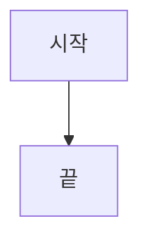

# CLAUDE.md

This file provides guidance to Claude Code (claude.ai/code) when working with code in this repository.

## 프로젝트 개요

한국어 로케일을 사용하는 블로그 중심의 Docusaurus 3.8.1 사이트입니다. TypeScript, React 19, MDX를 사용하여 콘텐츠를 작성합니다. 문서(docs) 모드는 비활성화되어 있고 블로그 기능만 활성화되어 있습니다.

## 기술 스택

- **프레임워크**: Docusaurus 3.8.1
- **언어**: TypeScript (strict mode)
- **UI**: React 19 (JSX transform)
- **콘텐츠**: MDX (live code blocks 지원)
- **패키지 매니저**: pnpm
- **배포**: GitHub Pages (ag502.github.io)
- **로케일**: 한국어 (ko)

## 개발 명령어

```bash
# 의존성 설치
pnpm install

# 개발 서버 시작 (localhost:3000에서 브라우저 자동 열림)
pnpm start

# 프로덕션 빌드
pnpm build

# 빌드된 사이트를 로컬에서 제공
pnpm serve

# Docusaurus 캐시 및 생성된 파일 삭제
pnpm clear

# TypeScript 타입 체크
pnpm typecheck

# ESLint 실행 (자동 수정)
pnpm fix

# ESLint 설정 검사
pnpm inspect-eslint

# GitHub Pages에 배포
pnpm deploy
```

## 프로젝트 구조

```
├── blog/                      # 블로그 포스트 (날짜 기반 폴더)
│   └── YYYY-MM-DD-slug/
│       └── index.mdx         # 블로그 포스트 내용
├── src/
│   ├── components/           # React 컴포넌트
│   ├── css/                  # 커스텀 CSS
│   └── pages/                # 커스텀 페이지
├── static/                   # 정적 에셋
├── docusaurus.config.ts      # Docusaurus 설정
├── sidebars.ts              # 사이드바 설정 (비어있음, docs 비활성화)
└── eslint.config.ts         # ESLint 설정
```

## 블로그 포스트

블로그 포스트는 다음과 같은 구조를 따릅니다:

1. **생성 방법**: 먼저 `blog/YYYY-MM-DD-slug/` 폴더를 생성한 다음, 그 안에 `index.mdx` 파일을 추가합니다.
1. **위치**: `blog/YYYY-MM-DD-slug/index.mdx`
2. **Frontmatter** (필수):
   ```yaml
   ---
   slug: post-slug
   title: 포스트 제목
   tags: [태그1, 태그2]
   unlisted: true  # 선택사항, 목록에서 숨김
   ---
   ```
3. **발췌문 마커**: `{/* truncate */}`를 사용하여 요약문이 끝나는 지점을 표시

4. **태그 추가**: 새로운 태그를 추가하려면 두 곳을 수정해야 합니다:
   - 포스트의 frontmatter에 태그 추가: `tags: [react, learning-react]`
   - `blog/tags.yml` 파일에 태그 정의 추가:
     ```yaml
     learning-react:
       label: Learning React
       permalink: /learning-react
       description: Learning React tag description
     ```

## 코드 품질 및 린팅

### ESLint 설정

프로젝트는 포괄적인 flat ESLint 설정(`eslint.config.ts`)을 사용합니다:

- **TypeScript**: recommended + stylistic type-checked 규칙
- **React**: react 및 react-hooks 플러그인의 recommended 규칙
- **Import 정렬**: 타입 import를 먼저 두는 엄격한 알파벳 순서
  - 그룹 순서: builtin → external → internal → parent → sibling → index → object → type
  - React import는 external 그룹의 맨 앞에 위치
  - import 그룹 사이에 빈 줄 필수
- **MDX**: MDX 파일 내 코드 블록도 린트
- **Prettier**: 통합 (세미콜론 사용, 작은따옴표 사용)

### Import 패턴

Docusaurus는 resolver 체크를 우회하는 특수 import 경로가 있습니다:
- `@theme/*` - 테마 컴포넌트
- `@docusaurus/*` - Docusaurus 모듈
- `@site/*` - 사이트 관련 import

이들은 ESLint에서 미해결 import 에러를 발생시키지 않도록 설정되어 있습니다.

### TypeScript

- Strict mode 활성화
- 타입 인식 린팅을 위한 project service 사용
- Base URL을 프로젝트 루트로 설정
- JSX transform: `react-jsx`

## 특수 기능

### Mermaid 다이어그램

마크다운에서 Mermaid가 활성화되어 있습니다. mermaid 코드 블록 사용:

````markdown

````

### Live Code Blocks

`@docusaurus/theme-live-codeblock` 테마가 활성화되어 있습니다. 인터랙티브 코드는 `live` 언어 사용:

````markdown
```jsx live
function Clock() {
  return <div>{new Date().toLocaleTimeString()}</div>;
}
```
````

**중요**: Live code blocks에서는 `import` 문을 사용할 수 없습니다. React와 useState 등의 Hook은 전역으로 사용 가능합니다.

### 분할 코드 블록 (Side-by-Side)

두 개의 코드를 나란히 보여주려면 MDX에서 flexbox를 사용:

````mdx
<div style={{display: 'flex', gap: '1rem'}}>
<div style={{flex: 1, minWidth: 0}}>

**왼쪽 코드:**

```jsx
// 코드 A
```

</div>
<div style={{flex: 1, minWidth: 0}}>

**오른쪽 코드:**

```jsx
// 코드 B
```

</div>
</div>
````

**주의**: `minWidth: 0`을 반드시 포함해야 횡스크롤이 생기지 않습니다.

### 섹션 요약 드롭다운

"섹션 요약해줘"라고 요청하면, 각 `##` 섹션의 끝에 `<details>` 드롭다운으로 요약을 추가합니다:

```mdx
<details>
<summary>섹션 요약</summary>

- 핵심 내용 1
- 핵심 내용 2
- 핵심 내용 3

</details>
```

**주의**: `<details>` 태그 전후로 빈 줄이 있어야 MDX에서 올바르게 렌더링됩니다. `<summary>` 뒤와 `</details>` 앞에도 빈 줄이 필요합니다.

## Docusaurus 설정

`docusaurus.config.ts`의 주요 설정:

- **Base URL**: `/` (루트)
- **Organization**: ag502
- **배포 브랜치**: main
- **로케일**: 한국어 (ko)
- **Docs**: 비활성화 (`docs: false`)
- **Blog**: RSS + Atom 피드 활성화
- **테마**: Mermaid + Live Codeblock
- **Future Flags**: Docusaurus v4 호환성 활성화

## GitHub Pages 배포

사이트는 GitHub Pages를 통해 `https://ag502.github.io`에 배포됩니다:

```bash
# SSH로 배포
USE_SSH=true pnpm deploy

# HTTPS로 배포
GIT_USER=ag502 pnpm deploy
```

이 명령은 사이트를 빌드하고 `main` 배포 브랜치에 푸시합니다.
