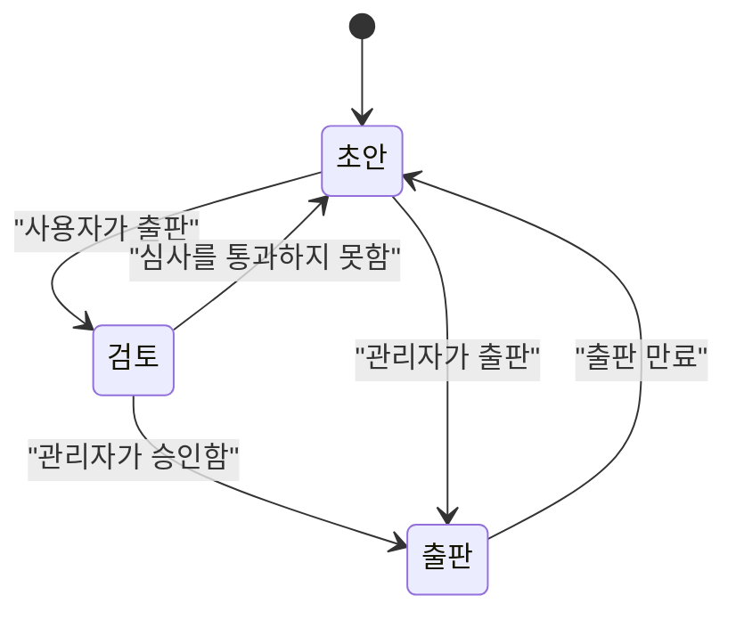
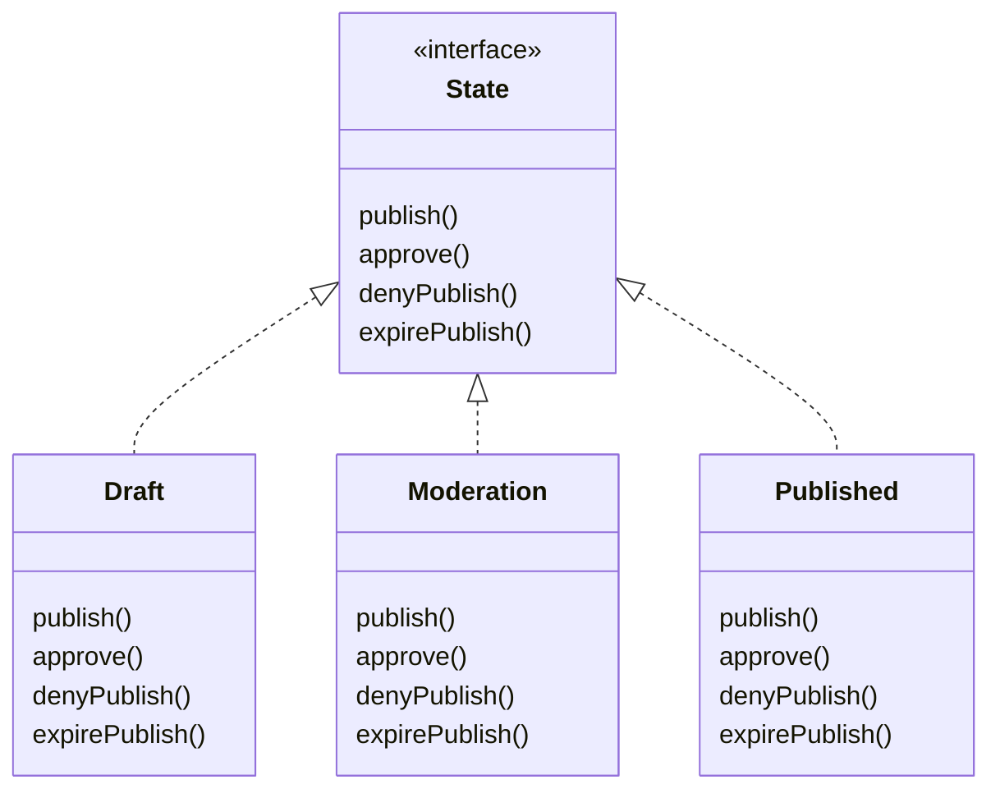
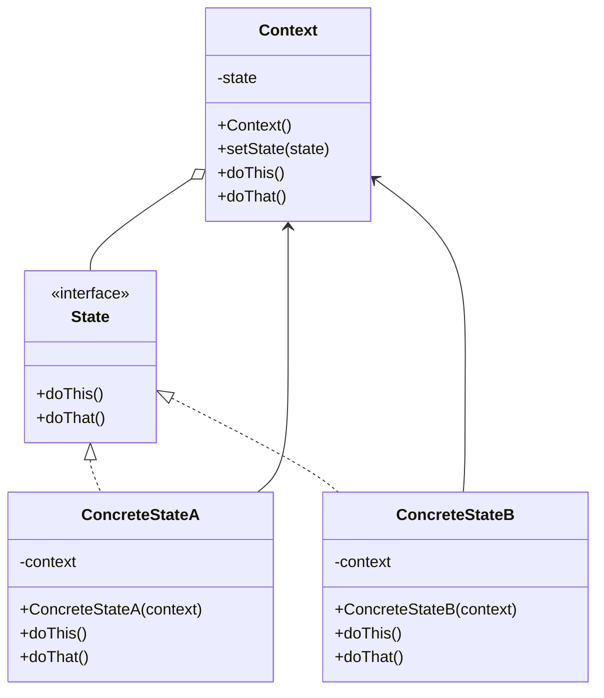

import Tabs from '@theme/Tabs';
import TabItem from '@theme/TabItem';

이 글에서는 행동 디자인 패턴 중 하나인 상태 패턴(State Pattern)의 정의와 구현 방법 및 사용예시에 대해 살펴보겠습니다.

{/* truncate */}

## 🌃 정의

상태 패턴은 객체의 내부 상태가 변경될 때 해당 객체가 행동을 변경할 수 있도록 하는 행동 디자인 패턴입니다.
객체가 행동을 바뀌면 해당 객체를 사용하는 클라이언트 입장에서는 객체의 클래스가 변경된 것처럼 보일 수 있습니다

## 🌃 출판 상태 제어하기

아래와 같은 흐름을 갖는 로직을 작성해야한다고 가정해보겠습니다.



## 🌃 유한 상태 기계(Finite State Machine)

위에서 출판 상태의 흐름을 시각화한 다이어그램을 상태 다이어그램이라 하며,
이 다이어그램에 정의된 규칙에 따라 동작하는 기계를 유한 상태 기계(Finite State Machine)라고 합니다.

상태 다이어그램에서 각 노드(이 경우 사각형)는 하나의 상태를 나타내며, 위 다이어그램의 시작 상태는 ‘초안’입니다.
각 상태는 유한 상태 기계가 어떤 방식으로 설정되어 있는지를 표현하며,
이 설정에 따라 특정한 동작을 수행합니다.

한 상태에서 다른 상태로 전환되기 위해서는 특정한 행동(이벤트)이 필요하며,
이는 화살표(전이)로 표현됩니다.
예를 들어, ‘초안’ 상태에서 ‘검토’ 상태로 전환되려면 ‘사용자가 출판’이라는 이벤트가 필요합니다.

## 🌃 유한 상태 기계 구현 방법 살펴보기

유한 상태 기계를 구현하는 방법을 살펴보겠습니다.

1. 상태들을 모아봅니다. 위의 상태 다이어그램에는 '출판', '검토', '초안' 3가지 상태가 존재합니다.
2. 현재 상태를 저장하는 인스턴스 변수를 만들고 각 상태의 값을 정의합니다.

   ```javascript
   const DRAFT = 0;
   const MODERATION = 1;
   const PUBLISHED = 2;

   const state = DRAFT;
   ```

3. 유한 상태 기계에서 발생할 수 있는 모든 행동을 모아 봅니다.
4. 이제 유한 상태 기계 역할을 하는 클래스를 만들어야 합니다. 각 행동을 구현할 때는 조건문을 써서 상태별로 어떤 작업을 처리해야 할지 결정합니다.
   예를 들어, '출판' 행동은 다음과 같은 메서드로 처리할 수 있습니다.

   ```javascript
   function publish() {
     if (state === DRAFT) {
       if (currentUser.role === 'admin') {
         state = PUBLISHED;
         console.log('출판되었습니다.');
       } else {
         state = MODERATION;
         console.log('출판되었습니다. 검토 단계로 진입합니다.');
       }
     } else if (state === MODERATION) {
       console.log('검토 단계 입니다.');
     } else if (state === PUBLISHED) {
       console.log('이미 출판되었습니다.');
     }
   }
   ```

## 🌃 유한 상태 기계 구현하기

앞서 살펴본 방법을 바탕으로 출판 흐름의 유한 상태 기계를 구현해 보겠습니다.

```javascript
class DocumentMachine {
  static DRAFT = 0;
  static MODERATION = 1;
  static PUBLISHED = 2;

  state = DocumentMachine.DRAFT;

  publish() {
    if (this.state === DocumentMachine.DRAFT) {
      // 상태변경 ('초안' -> '검토', '초안' -> '출판')
      if (currentUser.role === 'admin') {
        this.state = DocumentMachine.PUBLISHED;
        console.log('출판되었습니다.');
      } else {
        this.state = DocumentMachine.MODERATION;
        console.log('출판되었습니다. 검토 단계로 진입합니다.');
      }
    } else if (this.state === DocumentMachine.MODERATION) {
      console.log('검토 단계 입니다.');
    } else if (this.state === DocumentMachine.PUBLISHED) {
      console.log('이미 출판되었습니다.');
    }
  }

  approve() {
    if (this.state === DocumentMachine.MODERATION) {
      // 상태변경 ('검토' -> '출판')
      this.state = DocumentMachine.PUBLISHED;
      console.log('승인되었습니다.');
    } else if (this.state === DocumentMachine.PUBLISHED) {
      console.log('이미 승인되었습니다.');
    } else if (this.state === DocumentMachine.DRAFT) {
      console.log('초안 상태입니다.');
    }
  }

  denyPublish() {
    if (this.state === DocumentMachine.MODERATION) {
      // 상태변경 ('검토' -> '초안')
      this.state = DocumentMachine.DRAFT;
      console.log('거절되었습니다.');
    } else if (this.state === DocumentMachine.PUBLISHED) {
      console.log('이미 승인되었습니다.');
    } else if (this.state === DocumentMachine.DRAFT) {
      console.log('초안 상태입니다.');
    }
  }

  expirePublish() {
    if (this.state === DocumentMachine.PUBLISHED) {
      // 상태변경 ('출판' -> '초안')
      this.state = DocumentMachine.DRAFT;
      console.log('출판 만료되었습니다.');
    } else if (this.state === DocumentMachine.DRAFT) {
      console.log('초안 상태입니다.');
    } else if (this.state === DocumentMachine.MODERATION) {
      console.log('검토 단계 입니다.');
    }
  }
}
```

상태 변경을 트리거하는 이벤트를 메서드로 만든 후, 상태별로 취해야 할 행동을 해당 메서드내에서 분기처리하여 구현한것을 볼 수 있습니다.

## 🌃 문제점

위 방식은 현재는 정상 동작하지만, 상태가 추가되거나 행동이 변경될 경우 유지보수성이 크게 떨어집니다.

예를 들어 ‘공개 예정’ 상태가 추가되면, 코드에 해당 상태를 추가해야 하며 각 메서드에도 새로운 상태에 대한 분기처리를 추가해야 합니다. 상태가 여러 개 늘어날수록 수정 범위는 기하급수적으로 커지고 버그 발생 가능성도 함께 높아집니다.

## 🌃 개선하기

객체지향적으로 리팩토링하기 위해서는 변경이 발생하는 부분을 캡슐화해야 합니다. 이 경우, 상태별 동작이 자주 변경될 수 있으므로 각 상태를 별도의 클래스로 분리하고, 각 클래스가 자신이 수행해야 할 동작을 직접 구현하도록 변경해보겠습니다. 구현 단계는 아래와 같습니다.

1. 상태 다이어그램에 정의된 모든 행동에 관한 메소드가 들어있는 State 인터페이스나 추상 클래스를 정의해야 합니다.
2. 모든 상태를 대상으로 상태 클래스를 구현해야 합니다. 기계가 어떤 상태에 있다면, 그 상태에 해당하는 상태 클래스가 모든 작업을 책임지게 됩니다.
3. 기존 코드에 있던 조건문 코드를 상태 클래스에 위임해야 합니다.

### 🎆 State 클래스 구현하기

State 클래스는 구현 단계에서 언급했듯이 아래와 같은 상속 구조를 가집니다.



UML 다이어그램을 바탕으로 구현한 Draft 클래스는 아래와 같습니다.

```typescript
class Draft implements State {
  private documentMachine: DocumentMachine;

  constructor(documentMachine: DocumentMachine) {
    this.documentMachine = documentMachine;
  }

  publish() {
    if (currentUser.role === 'admin') {
      this.documentMachine.setState(documentMachine.getPublishedState());
      console.log('출판되었습니다.');
    } else {
      this.documentMachine.setState(documentMachine.getModerationState());
      console.log('출판되었습니다. 검토 단계로 진입합니다.');
    }
  }

  approve() {
    console.log('초안 상태입니다.');
  }

  denyPublish() {
    console.log('초안 상태입니다.');
  }

  expirePublish() {
    console.log('초안 상태입니다.');
  }
}
```

위 클래스를 바탕으로 다른 상태 클래스도 구현해보겠습니다.

<Tabs>
  <TabItem value="Moderation" label="Moderation">
```typescript
class Moderation implements State {
    private documentMachine: DocumentMachine;
    constructor(documentMachine: DocumentMachine) {
      this.documentMachine = documentMachine;
    }
    publish() {
      console.log('검토 단계 입니다.');
    }
    approve() {
      this.documentMachine.setState(documentMachine.getPublishedState());
      console.log('승인되었습니다.');
    }
    denyPublish() {
      this.documentMachine.setState(documentMachine.getDraftState());
      console.log('거절되었습니다.');
    }
    expirePublish() {
      this.state = DocumentMachine.DRAFT;
      console.log('출판 만료되었습니다.');
    }
}
```
</TabItem>
<TabItem value="Published" label="Published">
```typescript
class Published implements State {
    private documentMachine: DocumentMachine;
    constructor(documentMachine: DocumentMachine) {
      this.documentMachine = documentMachine;
    }
    publish() {
      console.log('이미 출판되었습니다.');
    }
    approve() {
      console.log('이미 출판되었습니다.');
    }
    denyPublish() {
      console.log('이미 출판되었습니다.');
    }
    expirePublish() {
      this.documentMachine.setState(documentMachine.getDraftState());
      console.log('출판 만료되었습니다.');
    }
}
```
</TabItem>
</Tabs>

구현된 상태 클래스에는 각 상태에 해당하는 전이(transition) 로직이 포함되어 있음을 확인할 수 있습니다.
또한 상태 인스턴스는 생성 시 유한 상태 기계 인스턴스의 레퍼런스를 전달받는데, 이는 다른 상태로 전환할 때 기계 클래스에 정의된 메서드를 호출하기 위함입니다.

### 🎆 DocumentMachine 클래스 구현하기

State 클래스를 구현했으니, 이제 DocumentMachine 클래스에 적용해보겠습니다.

```typescript
class DocumentMachine {
  private draftState: State;
  private moderationState: State;
  private publishedState: State;

  private state: State;

  constructor() {
    this.draftState = new Draft(this);
    this.moderationState = new Moderation(this);
    this.publishedState = new Published(this);

    this.state = this.draftState;
  }

  publish() {
    this.state.publish();
  }

  approve() {
    this.state.approve();
  }

  denyPublish() {
    this.state.denyPublish();
  }

  expirePublish() {
    this.state.expirePublish();
  }

  getDraftState() {
    return this.draftState;
  }

  getModerationState() {
    return this.moderationState;
  }

  getPublishedState() {
    return this.publishedState;
  }

  setState(state: State) {
    this.state = state;
  }
}
```

상태를 변경하는 메소드가 호출되면 해당 동작은 현재의 상태 인스턴스에 위임되도록하여 기존에 존재했었던 조건문들을 모두 제거했습니다.

## 🌃 구조

앞서 작성했던 코드를 바탕으로 상태 패턴의 구조를 살펴보겠습니다.



### 🎆 Context

Context는 ConcreteState 객체 중 하나에 대한 참조를 저장하고 모든 상태별 작업을 그곳에 위임합니다.
Context는 State 인터페이스를 통해 상태 객체와 통신하며, 새로운 상태 객체를 전달하기 위한 세터(setState)를 제공합니다.

### 🎆 State 인터페이스

State 인터페이스는 상태별 메서드를 선언합니다.

### 🎆 ConcreteState 클래스

ConcreteState 클래스는 상태별 메서드들에 대한 자체적인 구현을 제공합니다. 여러 상태에서 유사한 코드의 중복을 피하기 위하여 공통 행동을 캡슐화하는 중간 추상 클래스들을 제공할 수 있습니다.

State 객체들은 Context 객체에 대한 역참조를 저장합니다. 이 참조를 통해 State는 필요한 정보를 가져올 수 있고 상태 전이를 할 수 있습니다.

## 🎆 결론

지금까지 다양한 상태와 그 상태들 간의 전이를 효율적으로 관리하기 위한 상태 패턴에 대해 살펴보았습니다.
마지막으로, 상태 패턴을 적용하기 적합한 상황을 알아보며 글을 마무리하겠습니다.

1. 현재 상태에 따라 다르게 행동하는 객체가 있을 때, 상태들의 수가 많을 때, 그리고 상태별 코드가 자주 변경될 때 사용하는 것이 적합합니다.
2. 클래스 필드의 현재 값들에 따라 클래스가 행동하는 로직이 조건문들로 오염되었을 때 사용하는 것이 적합합니다.
3. 유사한 상태들에 중복 코드와 조건문이 많을때 사용하는 것이 적합합니다.

#### 참고 자료

- 헤드 퍼스트 디자인 패턴
- [디자인 패턴들](https://refactoring.guru/ko/design-patterns)
